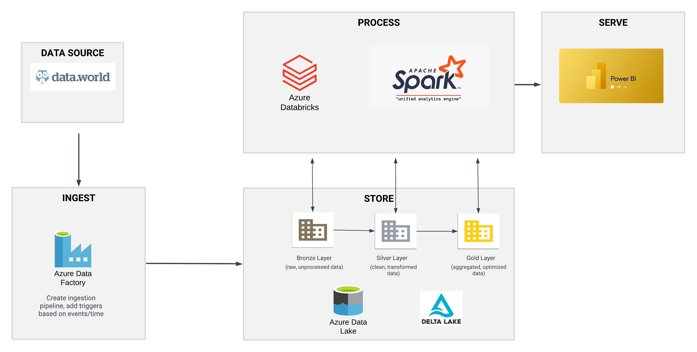

# E-Commerce Data Engineering project using Azure-Databricks-Pyspark

## Overview

This project showcases the management, streamline and data analysis of E-commerce data

## Project Goals

1. Data Ingestion:

- Objective: Build a robust ingestion pipeline to extract data from various data sources into a centralized data lake.
- Tools & Technologies: Azure Data Factory will be used as the primary orchestration tool to connect to various data sources, such as on-premises databases, cloud-based storage systems, or APIs.
- Process:
Azure Data Factory will be configured to extract data from csv files on a scheduled basis.
The ingested data will be loaded into the Bronze layer of the data lake (Raw Data), following the Medallion Architecture.

2. ETL System (Extract, Transform, Load):

- Objective: Transform the ingested raw data into parquet file format, ensuring data quality, consistency, and readiness for analysis.
- Tools & Technologies: Azure Databricks and Apache Spark will be utilized for processing and transforming the data.
- Process:
Data from the Bronze layer will be processed and cleaned in Azure Databricks, applying necessary transformations.
The transformed data will be loaded into the Silver layer (Cleaned & Enriched Data) and further into the Gold layer (Aggregated & Business-Ready Data) in the data lake.
The Silver layer stores structured data, while the Gold layer holds aggregated data that is optimized for reporting and analysis.

3. Store Data:

- Objective: Efficiently store the transformed and aggregated data for long-term storage and high-performance querying.
- Tools & Technologies: Azure Data Lake Storage and Delta Lake.
- Process:
The processed data will be stored as Delta Tables in the data lake, ensuring scalability, reliability, and ACID compliance.
The Bronze, Silver, and Gold layers in the Medallion Architecture will be used to manage different stages of data processing.

4. Reporting:

- Objective: Build an interactive dashboard to provide insights and answers to key business questions.
- Tools & Technologies: Power BI will be connected to the Gold layer for data visualization and reporting.
- Process:
Power BI will connect to the Delta Tables in the Gold layer to create dashboards and reports.
The dashboard will provide actionable insights, KPIs, and visual representations of the processed data.

## Dataset Used

The dataset used is a free e-commerce dataset that can be found on data.world.com . The data was scraped from a successful online C2C fashion store with over 9M registered users. The store was first launched in Europe around 2009 then expanded worldwide.

https://data.world/jfreex/e-commerce-users-of-a-french-c2c-fashion-store

## Architecture Diagram

## Sample Dashboard

After connecting Azure Databricks to PowerBI, a sample dashboard is created to check that the data streamlined correctly and are automatically refreshing. 
